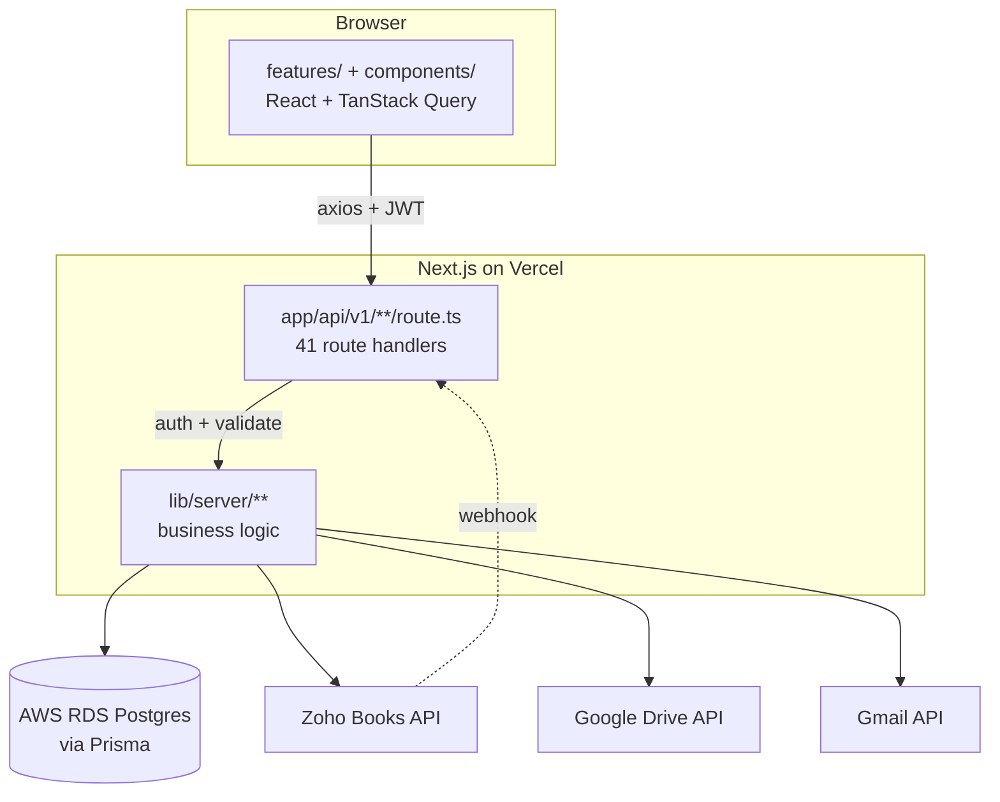
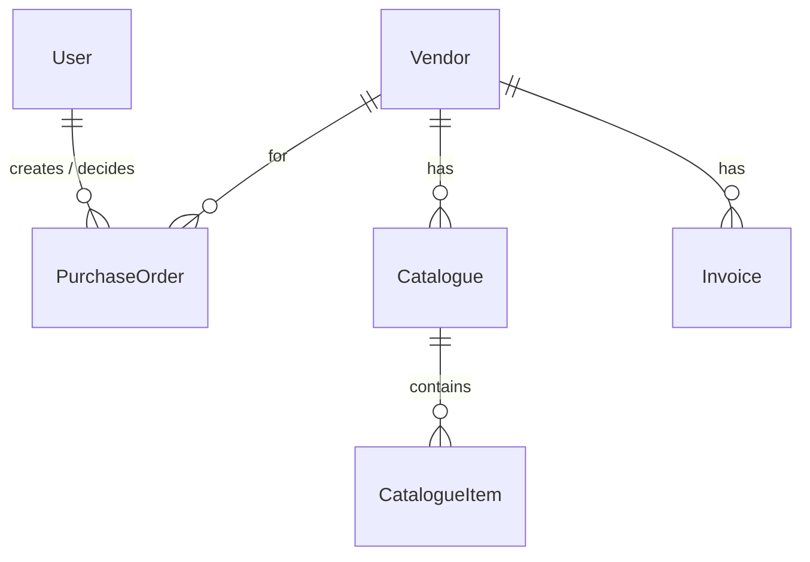
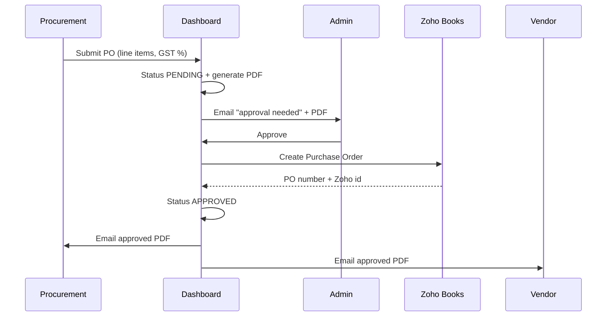

# Keystone Vendor Dashboard — Product Requirements Document

**Product:** Procurement & Vendor Management Dashboard
**Organisation:** Keystone Commerce Private Limited (Liwip)
**Status:** Deployed, in testing — pending cutover to the production Zoho Books account
**Document version:** 1.0

---

## 1. Overview

### 1.1 Problem

Keystone's procurement ran across three disconnected places:

| Where | What lived there | Problem |
|---|---|---|
| Spreadsheets | Vendor list, contract values, contacts | No history, no single source of truth |
| Google Drive | Catalogue PDFs | Filenames inconsistent; no link to a vendor |
| Zoho Books | Bills, invoices, purchase orders | Accountant-only; procurement had no visibility |

Consequences: no view of where a vendor sat in the pipeline, purchase orders raised
informally over chat/email with no approval trail, and invoice status invisible to
anyone outside Zoho.

### 1.2 Solution

A single internal web application that:

- tracks vendors through a **3-stage procurement pipeline**
- stores **catalogues** (with per-item pricing) against each vendor, backed by Google Drive
- **syncs invoices from Zoho Books in near-real-time** via webhooks
- runs a **submit → approve → dispatch** purchase-order workflow that produces a
  branded PDF on Keystone letterhead and creates the PO in Zoho Books
- gives the team **role-based access** with passwordless email sign-in

### 1.3 Non-goals

- Not an accounting system — Zoho Books remains the financial source of truth
- No payments/banking; payment status is *read* from Zoho, never written
- Not customer-facing; internal procurement tool only
- No inventory or stock management

---

## 2. Users & Roles

| Role | Who | Capabilities |
|---|---|---|
| **ADMIN** | Procurement head / founder | Everything: approve/reject POs, manage team, link vendors to Zoho, delete vendors, open records in Zoho |
| **PROCUREMENT_MEMBER** | Procurement executives | Create/edit vendors, upload catalogues, submit POs for approval. Cannot approve their own PO |
| **VIEWER** | Finance / leadership | Read-only |

Separation of duties is enforced server-side: submitting and approving are distinct
permissions, so a member cannot self-approve spend.

---

## 3. Technology Stack

### 3.1 Summary

| Layer | Technology | Version | Why |
|---|---|---|---|
| Framework | **Next.js (App Router)** | 14.2 | One deployable serving both UI and API |
| Language | **TypeScript** | 5.x | Types shared between client and server |
| UI | **React** | 18.3 | — |
| Styling | **Tailwind CSS** | 3.4 | Utility CSS + custom Keystone design tokens |
| Components | **shadcn/ui** pattern + Radix Slot | — | Copy-in components under `components/ui/` |
| Animation | **framer-motion** | 12.x | Theme-toggle icon transition |
| Icons | **lucide-react** | 1.x | — |
| Server state | **TanStack Query** | 5.x | Caching, invalidation, background refetch |
| Client state | **Zustand** | 5.x | Persisted auth session |
| Tables | **TanStack Table** | 8.x | Vendor table |
| Charts | **Chart.js** + react-chartjs-2 | 4.x | Dashboard analytics |
| Forms | **react-hook-form** + `@hookform/resolvers` | 7.x | — |
| Validation | **Zod** | 3.x | Shared client/server schemas |
| ORM | **Prisma** | 6.x | Type-safe DB access + migrations |
| Database | **PostgreSQL** (AWS RDS) | 15 | Managed; no built-in pooler |
| Auth | **jsonwebtoken** + **bcryptjs** | — | JWT access/refresh; hashed OTP codes |
| PDF | **pdf-lib** | 1.17 | PO generation, no native deps (serverless-safe) |
| Email | **Gmail API** (googleapis) + nodemailer fallback | 144.x / 6.x | Transactional mail |
| Files | **Google Drive API** (OAuth) | via googleapis | Catalogue storage |
| HTTP | **axios** | 1.x | Client API layer with token refresh |
| Toasts | **sonner** | 1.x | Theme-aware notifications |
| Serverless | **@vercel/functions** | 3.x | `waitUntil` for post-response work |
| Hosting | **Vercel** | — | Auto-deploy on merge, cron scheduler |

### 3.2 Why one Next.js app rather than separate frontend/backend

A prior iteration used a separate NestJS API. Consolidating removed a deployment
target, eliminated CORS handling, and allowed types (`lib/shared/`) to be imported
directly by both sides — a change to `VendorCategory` now fails the build on both
client and server rather than drifting silently.

---

## 4. Architecture



### 4.1 Layers

| Path | Runs | Responsibility |
|---|---|---|
| `app/` | both | Routing. Pages + 41 API route handlers |
| `features/` | client | UI grouped by domain (vendors, purchase-orders, dashboard, zoho, team, auth) |
| `components/` | client | Shared UI; `components/ui/` holds shadcn-style components |
| `lib/*.ts` | client | API client, auth store, formatters, theme context |
| `lib/server/**` | server | All business logic and integrations |
| `lib/shared/**` | both | Types, enums, Zod schemas, money helpers |
| `prisma/` | server | Schema + versioned migrations |

Route handlers are intentionally thin — auth, parse, delegate:

```ts
export async function POST(req: NextRequest, { params }: Ctx) {
  return handle(async () => {
    const user = requireRole(req, "ADMIN", "PROCUREMENT_MEMBER");
    return attachCatalogue(params.id, await req.json(), user.userId);
  });
}
```

`handle()` converts a thrown `HttpError(409, "…")` into the right status, so business
code never touches HTTP concerns.

---

## 5. Data Model

12 models. `Vendor` is the hub; children cascade on delete.



| Model | Purpose |
|---|---|
| `User` | Team member + role |
| `Vendor` | Core record incl. GST details and `zohoVendorId` link |
| `Catalogue` / `CatalogueItem` | Price lists; items carry unit price, UOM, HSN |
| `Invoice` | Synced from Zoho or added manually |
| `PurchaseOrder` | Line items as JSON, status, decision audit |
| `ZohoUnmatchedInvoice` | Review queue — invoice whose vendor couldn't be matched |
| `DriveUnassignedFile` / `IgnoredFile` / `FileAssignment` | Drive triage + remembered mappings |
| `AuditLog` | Every meaningful action |
| `LoginOtp` | Hashed one-time codes |

### 5.1 Enumerations

| Enum | Values |
|---|---|
| `UserRole` | ADMIN, PROCUREMENT_MEMBER, VIEWER |
| `VendorStage` | IN_TALKS, CATALOGUE_RECEIVED, PURCHASE_MADE |
| `VendorStatus` | ACTIVE, ON_HOLD, BLACKLISTED |
| `InvoiceStatus` | PAID, UNPAID, OVERDUE |
| `PurchaseOrderStatus` | PENDING, APPROVED, REJECTED |
| `DocumentSource` | MANUAL_UPLOAD, DRIVE_SYNC, ZOHO_SYNC |

**Vendor categories** are a code-managed list of 28 values (`lib/shared/enums.ts`),
deliberately *not* a Postgres enum — adding a category is a code change, not a
migration.

### 5.2 Money

Stored as **integer paise** (`₹1 = 100`) to avoid floating-point drift.

> ⚠️ **Known limitation:** money columns are `INT4`, capping a single value at
> **≈ ₹2.14 crore**. A larger invoice fails to sync with an integer-overflow error.
> Accepted for now; migrating to `BigInt` is the fix if larger orders appear.

`PurchaseOrder.total` is a `Float` in rupees — it mirrors Zoho's unit. This
inconsistency with the paise convention is deliberate but worth knowing.

---

## 6. Features

### 6.1 Authentication — passwordless

1. User enters email → if provisioned, a 6-digit code is **bcrypt-hashed** into
   `LoginOtp` and emailed (10-minute expiry, 5 attempts).
2. Correct code → **JWT access token (15 min)** + **refresh token (7 days)**.
3. Zustand persists them; the axios interceptor refreshes silently on 401.

No passwords are stored or reset. The OTP request response is identical whether or
not the email exists, so the endpoint can't be used to enumerate staff.

### 6.2 Vendor management

- CRUD with 28 categories, contact details, contract value/dates, rating, notes
- **GST fields**: GSTIN, full address, legal/trade name (GSTIN is unique; duplicates
  return a readable **409**, not a database error)
- CSV export
- Searchable/filterable table (debounced 350 ms) + **Kanban pipeline** board
- **Stage engine**: stage advances automatically as catalogues and purchases appear

### 6.3 Catalogues

- Upload a PDF → stored in the shared Drive folder → auto-attached to the vendor
- Or record a catalogue manually with structured items (name, unit price, UOM, HSN)
- Catalogue items feed the PO builder's product picker
- Unrecognised Drive files land in an **unassigned queue** for triage; assignments
  are remembered so the same vendor pattern auto-matches next time

### 6.4 Invoice sync (Zoho Books)

Three paths keep invoices current:

| Trigger | Mechanism | Latency |
|---|---|---|
| **Webhook** | Zoho workflow rule → `/api/v1/zoho/webhook` | ~1–2 s |
| **Cron** | Vercel Cron → `/api/v1/cron/sync` every 15 min | safety net |
| **Manual** | "Sync now" button | on demand |

Vendor matching order: Zoho link → exact name → partial name. No match → the
**unmatched queue** rather than a silently dropped invoice.

Payment status is mapped from Zoho (`paid` → PAID, `overdue` → OVERDUE,
`open`/`sent`/`draft`/`partially_paid` → UNPAID, voided → skipped). Zoho-synced
invoices are **read-only** in the dashboard — editing them locally would be
overwritten by the next sync.

> Requires **two** Zoho workflow rules: one on Invoices, one on **Payments**.
> Recording a payment isn't an invoice *edit*, so without the second rule the
> dashboard keeps showing Unpaid. See `docs/ZOHO_WEBHOOK_SETUP.md`.

### 6.5 Purchase orders — the core workflow



Guarantees:

- A PO is only marked APPROVED **after** Zoho accepts it. If Zoho rejects, the PO
  stays PENDING and the error surfaces.
- Approval is blocked with a clear message if the vendor isn't Zoho-linked.
- Rejection requires a reason, emailed to the submitter.
- Every transition is written to `AuditLog`.

**PDF (pdf-lib)** — reproduces Keystone's official letterhead:
header grid, supplier block (name, address, GSTIN, contact), fixed billing/delivery
addresses, material table (Sl, Item Code, Description, Brand, HSN, Qty, UOM, Rate,
GST %, Amount), commercial summary, all 20 Standard Terms & Conditions, and
signature blocks. Embeds the Keystone and Liwip logos.

- **GST is computed per line** and split by place of supply: same state as Karnataka
  → CGST + SGST; otherwise → IGST (derived from the supplier GSTIN's state code).
- Table rows match the item count exactly; the summary block is reserved so it can
  never overflow the page.
- Every cell is clipped to its **measured** column width; amounts shrink rather than
  truncate, since a clipped figure would be wrong rather than merely ugly.

### 6.6 Dashboard

Stats (on demand, to keep first paint fast) with four Chart.js charts: pipeline
distribution, contract value by category, invoice status doughnut, top 5 vendors.
Compact integration status chips for Zoho and Drive with live health indicators.

### 6.7 Theming

Light/dark via a `ThemeProvider` context (single shared source, so charts repaint
when the toggle flips). Palette is CSS variables in **RGB-channel form** so Tailwind
opacity modifiers (`bg-orange-light/40`) still work. An inline script applies the
saved theme before first paint to avoid a flash.

---

## 7. Integrations

### 7.1 Zoho Books

| Concern | Approach |
|---|---|
| Auth | Self-client OAuth; refresh token exchanged for 1-hour access tokens, cached in memory |
| Reads | Bills or Invoices (`ZOHO_INVOICE_SOURCE`), PDFs |
| Writes | Vendors (contacts), items, purchase orders |
| Real-time | Workflow rule → webhook (invoices **and** payments) |

Two implementation constraints discovered in practice:

1. The webhook **must respond immediately** and sync in the background — a full sync
   takes ~11 s and Zoho times out. On Vercel this additionally needs
   `waitUntil()`, or the serverless instance freezes the moment the response is sent
   and the sync silently never runs.
2. **HSN belongs on the item master, not the PO line** — sending `hsn_or_sac` on a
   purchase-order line returns `400 Invalid Element`.

> ⚠️ Zoho rate-limits token refreshes. Repeated server restarts clear the in-memory
> cache and can trip *"too many requests continuously"*, disabling all Zoho calls for
> 15–30 minutes. A database-backed token cache is the recommended hardening.

### 7.2 Google Drive

OAuth (not a service account — service accounts have no personal storage quota and
uploads fail with a quota error). Uploads go to a fixed "Vendors Catalog" folder.

### 7.3 Gmail

Sends via the **Gmail API** with the `gmail.send` scope, not SMTP — SMTP would
require the far broader `https://mail.google.com/` scope. `MailComposer` builds MIME
so PDFs can be attached. Falls back to SMTP, then to console logging in development.

---

## 8. Security

| Control | Implementation |
|---|---|
| Authentication | Passwordless OTP; bcrypt-hashed codes, 10-min expiry, 5 attempts |
| Session | Short-lived JWT + refresh rotation |
| Authorisation | `requireUser` / `requireRole` on every handler; server-side, never trusted from the client |
| Webhook | Shared secret via query token or header; **rejects when unset** rather than running open |
| Cron | `Bearer CRON_SECRET` |
| Secrets | `.env` and service-account JSON gitignored; never committed |
| Audit | `AuditLog` records actor, action, entity, metadata |
| Data exposure | Zoho deep-links are Admin-only |

---

## 9. Environment Configuration

```bash
# Database (AWS RDS Postgres)
DATABASE_URL=            # instance endpoint :5432, ?sslmode=require&connection_limit=5
DIRECT_URL=              # same URL without connection_limit; migrations only

# Auth
JWT_ACCESS_SECRET= / JWT_ACCESS_TTL=15m
JWT_REFRESH_SECRET= / JWT_REFRESH_TTL=7d
APP_URL=

# Zoho Books
ZOHO_ENABLED=true
ZOHO_DC=in
ZOHO_CLIENT_ID= / ZOHO_CLIENT_SECRET= / ZOHO_REFRESH_TOKEN=
ZOHO_ORGANIZATION_ID=
ZOHO_INVOICE_SOURCE=invoices     # or "bills"
ZOHO_WEBHOOK_SECRET=
CRON_SECRET=

# Google Drive (OAuth)
GOOGLE_DRIVE_CLIENT_ID= / _CLIENT_SECRET= / _REFRESH_TOKEN= / _FOLDER_ID=

# Gmail API
GMAIL_OAUTH_CLIENT_ID= / _CLIENT_SECRET= / _REFRESH_TOKEN=
GMAIL_SENDER_EMAIL= / GMAIL_SENDER_NAME=
# (approvers are the ADMIN users in the database — no env var)
```

> **`connection_limit=5` on AWS RDS** — RDS has no built-in connection pooler, so each
> warm serverless instance opens and holds its own pool. The instance allows 79
> connections, roughly 8 of which AWS keeps for itself, so a bounded pool is what stops a
> traffic spike exhausting `max_connections` and failing every query at once. Use **RDS
> Proxy** if you outgrow it.

---

## 10. Deployment

| | |
|---|---|
| Host | Vercel — auto-deploy on merge to `main`, preview deploy per PR |
| Build | `prisma generate && next build` |
| Migrations | `prisma migrate deploy` |
| Cron | `vercel.json` → `/api/v1/cron/sync` every 15 min (`*/15 * * * *`) |
| Database | AWS RDS Postgres (shared by preview and production) |

> ⚠️ Preview deployments share the **production database**. Data created in a preview
> is real.

### 10.1 Migration to AWS (under consideration)

Company policy may require AWS. **Amplify Hosting** is the closest equivalent
(GitHub-connected, auto-deploy, native Next.js SSR). Two things must change:
`waitUntil` is Vercel-specific, and the `vercel.json` cron becomes an **EventBridge**
schedule. AWS also enables a **fixed outbound IP**, which Vercel cannot provide —
that would unblock the government GST API, which requires IP whitelisting.

---

## 11. Known Limitations & Roadmap

| # | Item | Impact | Status |
|---|---|---|---|
| 1 | INT4 money cap (≈ ₹2.14 crore) | Large invoices fail to sync | Accepted; BigInt migration if needed |
| 2 | Zoho token cache is in-memory | Restarts trip the refresh rate limit | Recommended: DB-backed cache |
| 3 | GSTIN auto-fetch not implemented | Address/legal name entered manually | Blocked — NIC API needs a whitelisted IP (see §10.1) |
| 4 | `partially_paid` shows as UNPAID | Part-payments look unpaid | Add a PARTIAL status |
| 5 | Payment status needs a second Zoho rule | Manual setup step | Documented |
| 6 | Drive/Gmail refresh tokens can be revoked | Uploads/email stop | Health chips surface it |

### Future scope

Vendor performance scoring · budget tracking per cost centre · goods-receipt notes ·
multi-currency · PDF logo bundling verified on serverless · partial-payment status.

---

## 12. Success Criteria

| Goal | Measure | Status |
|---|---|---|
| Single source of vendor truth | Vendors managed only in the dashboard | ✅ |
| PO approvals leave a trail | Every PO has submitter, approver, timestamp, reason | ✅ |
| Invoices visible without Zoho access | Synced within seconds of creation | ✅ verified |
| Branded, compliant PO document | Matches official template incl. GST split and T&Cs | ✅ |
| No password management | Passwordless sign-in | ✅ |
| Production cutover | Connected to the main Zoho organisation | ⏳ pending |

---

## Appendix A — API Surface (41 endpoints)

| Group | Endpoints |
|---|---|
| **Auth** | `POST /auth/login`, `/auth/logout`, `/auth/refresh`, `GET /auth/me`, `POST /auth/otp/request`, `/auth/otp/verify` |
| **Vendors** | `GET,POST /vendors` · `GET,PATCH,DELETE /vendors/[id]` · `POST /vendors/[id]/stage` · `POST /vendors/[id]/zoho-link` · `GET /vendors/export.csv` |
| **Catalogues** | `GET,POST /vendors/[id]/catalogues` · `POST /vendors/[id]/catalogues/upload` · `GET,DELETE /catalogues/[id]` · `POST /catalogues/[id]/items` · `DELETE /catalogue-items/[itemId]` |
| **Invoices** | `GET,POST /invoices` · `PATCH,DELETE /invoices/[id]` · `GET,POST /vendors/[id]/invoices` |
| **Purchase Orders** | `GET,POST /purchase-orders` · `POST /purchase-orders/[id]/approve` · `/reject` · `GET /purchase-orders/[id]/pdf` |
| **Zoho** | `GET /zoho/status` · `POST /zoho/sync` · `GET /zoho/invoices` · `GET /zoho/invoices/[zohoId]/pdf` · `GET /zoho/vendors` · `POST /zoho/vendors/link` · `GET /zoho/unmatched` · `POST /zoho/unmatched/[zohoId]/assign` · `POST,GET /zoho/webhook` |
| **Drive** | `GET /drive/status` · `POST /drive/sync` · `GET /drive/unassigned` · `POST /drive/unassigned/[fileId]/assign` · `/ignore` |
| **Admin** | `GET,POST /users` · `PATCH,DELETE /users/[id]` · `GET /dashboard/stats` · `GET /cron/sync` |

## Appendix B — Repository Layout

```
app/
  api/v1/**/route.ts     41 API handlers
  layout.tsx  page.tsx  providers.tsx  globals.css
features/
  auth/ dashboard/ vendors/ purchase-orders/ pipeline/ zoho/ team/ layout/
components/
  Modal  SearchableSelect  Skeleton
  ui/    button  progress-button  interactive-hover-button
         show-more  animated-theme-toggle
lib/
  api.ts  api-client.ts  auth-store.ts  use-theme.tsx  utils.ts  format.ts
  server/   auth  vendors  catalogues  invoices  purchase-orders  po-pdf
            mail  otp  audit  dashboard  stage-engine  http
            zoho/{auth,client,service,matcher,status-util}
            drive/{google,service,matcher,vendors-catalog,filename}
            assets/{keystone-logo.jpg,liwip-logo.png}
  shared/   types  enums  schemas  money  gstin
prisma/     schema.prisma  migrations/
docs/       ZOHO_WEBHOOK_SETUP.md  PRD.md
```
