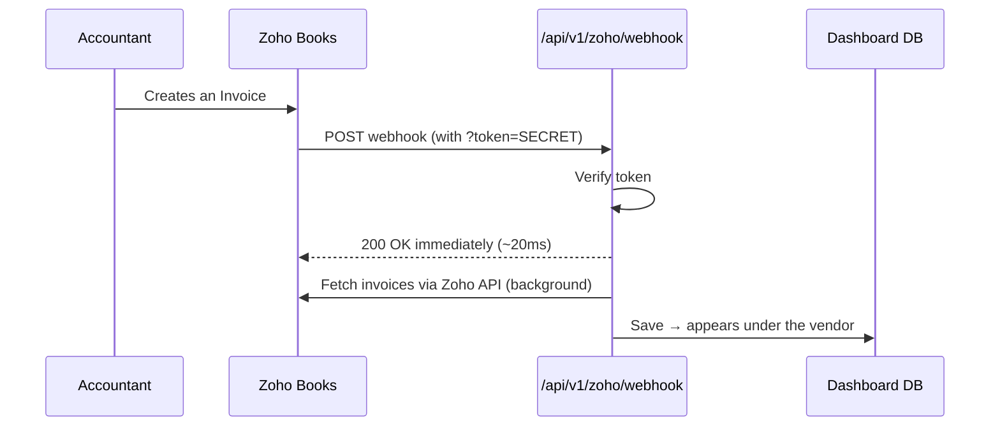

# Zoho Books → Dashboard: Real-Time Invoice Sync (Webhook)

## What this does

Instead of clicking **"Sync invoices"** every time, Zoho *tells* the dashboard the
moment an invoice is created, and it syncs within seconds.

| | Direction | Behaviour |
|---|---|---|
| **Polling (old)** | We ask Zoho every X minutes | Delay up to X min, wasted API calls |
| **Webhook (new)** | Zoho calls us instantly | ~1–2 seconds, no wasted calls |

### Flow



**Key design point:** the endpoint replies to Zoho **immediately**, then syncs in the
background. If it synced first (≈11s), Zoho would hit a **read timeout**.

---

## Credentials needed

| Variable | Where it comes from | Purpose |
|---|---|---|
| `ZOHO_WEBHOOK_SECRET` | **We generate it** (any random string) | Proves the caller is really Zoho |
| `ZOHO_CLIENT_ID` / `_SECRET` / `_REFRESH_TOKEN` | Already configured | Used to fetch the invoice data |
| `CRON_SECRET` | We generate it | Secures the daily safety-net sync |

> Zoho does **not** issue a "webhook credential." A webhook is Zoho calling *us*, so
> *we* hand Zoho a secret token inside the URL.

Generate a secret:

```bash
node -e "console.log('whk_'+require('crypto').randomBytes(24).toString('hex'))"
```

---

## Part A — Zoho Books setup

**Zoho Books → Settings (⚙️) → Automation → Workflow Rules → + New Workflow Rule**

### Step 1 — Create the rule


| Field | Value |
|---|---|
| Workflow Rule Name | `Sync to Dashboard` |
| Module | **Invoice** |
| Execute Workflow For | **All Invoice Types** |

Click **Next**.

### Step 2 — Trigger


| Field | Value |
|---|---|
| Workflow Type | **Event Based** |
| Action Type | **Created** |

Click **Next**.

### Step 3 — Criterion (Zoho requires one)


Zoho won't let you skip criteria, so use an always-true one:

| Field | Condition | Value |
|---|---|---|
| `Invoice#` | **is not empty** | *(leave blank)* |

Click **Done**. Every invoice has a number, so this matches all of them.

### Step 4 — Add the webhook action


1. Click **➕ Immediate Actions**
2. **Action Type:** `Webhook` → **Add New Action**
3. Fill in:

| Field | Value |
|---|---|
| Name | `Dashboard sync` |
| Module | Invoice |
| Method | **POST** |
| URL to Notify | `https://<YOUR-URL>/api/v1/zoho/webhook?token=<ZOHO_WEBHOOK_SECRET>` |
| Headers / Parameters | leave default |

4. **Save** the webhook → select it in the **Name** dropdown → **Associate**


### Step 5 — Test

Create a new invoice in Zoho → it should appear in the dashboard within seconds.

---

## Part B — Production setup (Vercel)

1. **Vercel → Settings → Environment Variables** (tick **Production**):
   - `ZOHO_WEBHOOK_SECRET` = your generated secret
   - `CRON_SECRET` = any random string
2. **Redeploy** — env changes don't apply to existing deployments.
3. In Zoho, set the webhook URL to the production URL:

   ```text
   https://<production-url>/api/v1/zoho/webhook?token=<ZOHO_WEBHOOK_SECRET>
   ```

There is also a **daily safety-net cron** (`vercel.json` → `/api/v1/cron/sync` at
02:00) that catches anything a missed webhook would drop.

---

## Part C — Testing locally (optional)

Zoho can't reach `localhost`, so you need a public tunnel.

```bash
# 1. start the app
pnpm run dev

# 2. open a tunnel (no install/signup needed — uses built-in SSH)
ssh -o StrictHostKeyChecking=accept-new -R 80:localhost:3000 nokey@localhost.run
```

It prints a public URL like `https://079ee0b0fb6b24.lhr.life`. Use that in the Zoho
webhook URL:

```text
https://079ee0b0fb6b24.lhr.life/api/v1/zoho/webhook?token=<SECRET>
```

> ⚠️ **The tunnel URL is temporary.** If the tunnel drops, the URL changes and you
> must re-paste it into Zoho. Local testing only — production uses the permanent URL.

Verify the tunnel reaches the webhook:

```bash
curl -X POST "https://<tunnel>/api/v1/zoho/webhook?token=<SECRET>"
# expect: {"ok":true,"queued":true,"at":"..."}
```

---

## Troubleshooting — problems actually hit during setup

| Symptom | Cause | Fix |
|---|---|---|
| **"Read Timeout"** when saving the webhook in Zoho | Endpoint ran the full sync (~11s) before replying | Reply `200` immediately, sync in background ✅ |
| Invoice created but nothing synced | **Tunnel had died** (URL returned 503) | Restart tunnel, update the URL in Zoho |
| Live webhook returns `401` even with the right token | `ZOHO_WEBHOOK_SECRET` not set in Vercel | Add the env var + redeploy |
| `/cron/sync` returns 200 with no auth | `CRON_SECRET` not set | Add it (otherwise anyone can trigger a sync) |
| One invoice never syncs; logs show `Unable to fit integer value … into an INT4` | Amount exceeds the 32-bit money column (**max ≈ ₹2.14 crore**) | Fix the amount in Zoho, or migrate money columns to `BigInt` |
| Zoho calls arrive but nothing appears | Vendor not linked to the Zoho contact | Invoice lands in the **unmatched** queue → assign it |

---

## How to verify it is genuinely working

1. **Count webhook hits before/after** creating an invoice:

   ```bash
   grep -c "POST /api/v1/zoho/webhook" <dev-log>
   ```

2. **Zoho's calls have a trailing `&`** in the URL (`?token=xxx&`) — that's how you
   tell them apart from your own `curl` tests.
3. **Response time should be small** (17–450ms). Multi-second times mean the
   respond-first fix isn't in place.

Verified result during setup: webhook calls went `6 → 9`, invoices `7 → 9`
(INV-000022, INV-000023 synced automatically), response times 449ms → 180ms → 17ms.

---

## Endpoints reference

| Endpoint | Auth | Purpose |
|---|---|---|
| `POST /api/v1/zoho/webhook?token=…` | `ZOHO_WEBHOOK_SECRET` | Real-time trigger from Zoho |
| `GET /api/v1/cron/sync` | `Bearer CRON_SECRET` | Daily safety-net sync (Vercel Cron) |
| `POST /api/v1/zoho/sync` | Logged-in user | The manual "Sync invoices" button |

---

> 🔒 **Never commit the secret to this repo** — keep it in `.env` (gitignored) and in
> Vercel's environment settings.

## Screenshots

Save the setup screenshots into `docs/images/` with these names so the embeds above
resolve:

- `zoho-webhook-01-new-rule.png`
- `zoho-webhook-02-trigger.png`
- `zoho-webhook-03-criterion.png`
- `zoho-webhook-04-actions.png`
- `zoho-webhook-05-attached.png`
