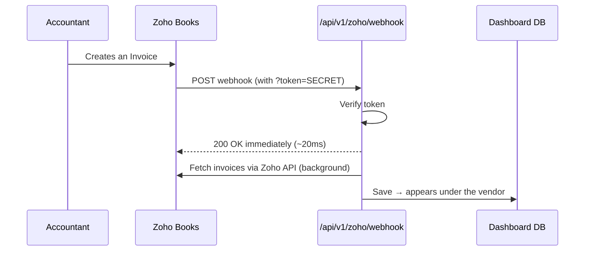

# Zoho Books → Dashboard: Credentials & Real-Time Sync

> **Part A** covers the four Zoho API credentials (client id, secret, refresh token,
> organization id). **Parts B–E** cover the real-time webhook. Do Part A first — the
> webhook can't fetch anything without those credentials.

## What this does

Instead of clicking **"Sync invoices"** every time, Zoho *tells* the dashboard the
moment an invoice is created, and it syncs within seconds.

| | Direction | Behaviour |
|---|---|---|
| **Polling (old)** | We ask Zoho every X minutes | Delay up to X min, wasted API calls |
| **Webhook (new)** | Zoho calls us instantly | ~1–2 seconds, no wasted calls |

### Flow



**Key design point:** the endpoint replies to Zoho **immediately**, then syncs in the
background. If it synced first (≈11s), Zoho would hit a **read timeout**.

---

## Credentials needed

| Variable | Where it comes from | Purpose |
|---|---|---|
| `ZOHO_CLIENT_ID` | Zoho API Console (Part A) | Identifies our app to Zoho |
| `ZOHO_CLIENT_SECRET` | Zoho API Console (Part A) | Password for that app |
| `ZOHO_REFRESH_TOKEN` | Exchanged for a grant code (Part A) | Lets us mint access tokens forever |
| `ZOHO_ORGANIZATION_ID` | Zoho Books → Organization Profile (Part A) | Which Zoho org to read/write |
| `ZOHO_DC` | Your data centre — `in`, `com`, `eu`… (default `in`) | Picks the right Zoho domain |
| `ZOHO_WEBHOOK_SECRET` | **We generate it** (any random string) | Proves the caller is really Zoho |
| `CRON_SECRET` | We generate it | Secures the scheduled safety-net sync |

> Zoho does **not** issue a "webhook credential." A webhook is Zoho calling *us*, so
> *we* hand Zoho a secret token inside the URL.

Generate the two secrets we own:

```bash
node -e "console.log('whk_'+require('crypto').randomBytes(24).toString('hex'))"   # ZOHO_WEBHOOK_SECRET
node -e "console.log('cron_'+require('crypto').randomBytes(24).toString('hex'))"  # CRON_SECRET
```

---

## Part A — Generating the Zoho API credentials

These four are what let the dashboard read invoices and create vendors/POs in Zoho.
Everything below uses the **India** data centre (`.in`). If your org is on another DC,
swap the domain (`.com`, `.eu`, `.au`) **consistently** — a mismatch is the single most
common cause of `invalid_client`.

### A1 — Client ID + Client Secret

1. Go to the Zoho API Console: **https://api-console.zoho.in**
2. **Add Client** → choose **Self Client**

   > Self Client is the right type for a server-to-server integration like this: no
   > browser redirect, no user sign-in each time. Don't pick "Web Based".

3. Zoho shows the **Client ID** and **Client Secret** — copy both.

```bash
ZOHO_CLIENT_ID="1000.XXXXXXXXXXXXXXXXXXXXXXXX"
ZOHO_CLIENT_SECRET="xxxxxxxxxxxxxxxxxxxxxxxxxxxxxxxxxx"
```

### A2 — Refresh Token (two steps: grant code → refresh token)

**Step 1 — generate a grant code**

In the same Self Client, open the **Generate Code** tab:

| Field | Value |
|---|---|
| Scope | `ZohoBooks.fullaccess.all` |
| Time Duration | `10 minutes` |
| Scope Description | anything, e.g. `dashboard sync` |

Click **Create**, pick your **organization/portal**, then copy the **grant code**.

> ⚠️ The grant code is **single-use** and expires in ~10 minutes. If the next step
> fails with `invalid_code`, just generate a fresh one.

<details>
<summary>Narrower scopes instead of full access</summary>

Paste this as the scope (comma-separated, no spaces):

```text
ZohoBooks.bills.READ,ZohoBooks.bills.CREATE,ZohoBooks.purchaseorders.READ,
ZohoBooks.purchaseorders.CREATE,ZohoBooks.contacts.READ,ZohoBooks.contacts.CREATE,
ZohoBooks.settings.READ,ZohoBooks.settings.CREATE,ZohoBooks.accountants.READ
```

Every Zoho call the app makes, and the scope it needs:

| Endpoint | Scope | Used for |
|---|---|---|
| `GET /bills` | `bills.READ` | Sync bills into the dashboard |
| `GET /bills/{id}?accept=pdf` | `bills.READ` | Bill PDF |
| `POST /bills` | `bills.CREATE` | Convert an approved PO into a Bill |
| `POST /purchaseorders` | `purchaseorders.CREATE` | Create the PO in Zoho on approval |
| `GET /purchaseorders/{id}?accept=pdf` | `purchaseorders.READ` | PO PDF |
| `GET /contacts?contact_type=vendor` | `contacts.READ` | List Zoho vendors when linking |
| `POST /contacts` | `contacts.CREATE` | "Create in Zoho & link" on a vendor |
| `GET /items?search_text=…` | `settings.READ` | Find an existing product before adding a PO line |
| `POST /items` | `settings.CREATE` | Create the product if it isn't in Zoho yet |
| `GET /chartofaccounts` | `accountants.READ` | Pick the expense/COGS account a new item posts to |

**Not in the list, on purpose:** `POST /purchaseorders/{id}/email`. Zoho can email a PO
itself, but it sends *its* plain PDF. The vendor gets our Keystone letterhead PDF
instead, sent through Gmail — so `createZohoPurchaseOrder()` is called without
`emailTo` and that endpoint never fires. No scope is needed for it. All outbound mail
(login codes, approval requests, the vendor's PO) goes through the `GMAIL_OAUTH_*`
credentials, which are independent of Zoho.

Two of these are easy to get wrong, because the scope name doesn't match the endpoint
name — both are per Zoho's
[official scope table](https://www.zoho.com/books/api/v3/oauth/#scopes):

> - **Items use `settings`, not `items`.** There is no `ZohoBooks.items.*` scope. The
>   `settings` scope covers "Items, Expense Categories, Users, Taxes, Currencies, and
>   Opening Balances".
> - **Chart of accounts uses `accountants`, not `settings`.** `/chartofaccounts`
>   belongs to the Accountant module. Without `ZohoBooks.accountants.READ`, approving a
>   PO fails when it tries to resolve the purchase account for a new item.

> ⚠️ Add `ZohoBooks.invoices.READ` **only** if you set `ZOHO_INVOICE_SOURCE="invoices"`
> to read customer invoices instead of supplier bills. The procurement flow uses bills,
> so it isn't needed by default.

`fullaccess.all` is simpler and is what most setups use.
</details>

**Step 2 — exchange it for a refresh token**

Run this within 10 minutes of generating the code:

```bash
curl -X POST "https://accounts.zoho.in/oauth/v2/token" \
  -d "grant_type=authorization_code" \
  -d "client_id=<ZOHO_CLIENT_ID>" \
  -d "client_secret=<ZOHO_CLIENT_SECRET>" \
  -d "code=<GRANT_CODE>"
```

The response contains both tokens — **save the `refresh_token`**:

```json
{
  "access_token":  "1000.xxxx…",   // expires in 1 hour — the app fetches these itself
  "refresh_token": "1000.yyyy…",   // ← this is ZOHO_REFRESH_TOKEN (does not expire)
  "expires_in": 3600
}
```

The refresh token is permanent unless revoked. The app caches an access token in
memory and only refreshes it near expiry.

> ⚠️ **Zoho rate-limits token refreshes.** Refreshing too often returns
> `"You have made too many requests continuously"` and *all* Zoho calls fail for a
> while. This usually shows up when a server restarts repeatedly (each restart clears
> the in-memory token cache). If you hit it, wait 15–30 minutes — there's no way to
> force-clear it.

### A3 — Organization ID

**Zoho Books → Settings (⚙️) → Organization Profile** — the **Organization ID** is
shown there (a long number).

Or fetch it with the access token from A2:

```bash
curl "https://www.zohoapis.in/books/v3/organizations" \
  -H "Authorization: Zoho-oauthtoken <ACCESS_TOKEN>"
```

### A4 — Put them in the environment

```bash
ZOHO_ENABLED="true"
ZOHO_DC="in"                        # in | com | eu | au …
ZOHO_CLIENT_ID="1000.XXXX"
ZOHO_CLIENT_SECRET="xxxx"
ZOHO_REFRESH_TOKEN="1000.yyyy"
ZOHO_ORGANIZATION_ID="60000000000"
ZOHO_INVOICE_SOURCE="bills"      # "invoices" (customer) or "bills" (vendor)
```

Locally these go in `.env`; in production, **Vercel → Settings → Environment
Variables**, then **redeploy** (env changes don't reach existing deployments).

Check it worked — the Zoho chip on the dashboard should show green, or:

```bash
curl -s localhost:3000/api/v1/zoho/status -H "Authorization: Bearer <app-jwt>"
```

**Switching to a different Zoho account later:** replace all four values *and*
re-link every vendor ("Create in Zoho & link"). The stored `zohoVendorId`s point at
the old organization and won't resolve in the new one.

---

## Part B — Zoho Books webhook setup

**Zoho Books → Settings (⚙️) → Automation → Workflow Rules → + New Workflow Rule**

### Step 1 — Create the rule


| Field | Value |
|---|---|
| Workflow Rule Name | `Sync to Dashboard` |
| Module | **Invoice** |
| Execute Workflow For | **All Invoice Types** |

Click **Next**.

### Step 2 — Trigger


| Field | Value |
|---|---|
| Workflow Type | **Event Based** |
| Action Type | **Created** |

Click **Next**.

### Step 3 — Criteria (skip them)


The criteria panel asks **"Add criteria for this workflow rule?"** and defaults to
**Yes**. Select **No**, then click **Done** — you want *every* invoice to trigger a
sync, not a filtered subset.

Zoho warns *"you will not be able to add any criteria for this workflow rule"*; that's
expected and fine.

> If your Zoho edition insists on a criterion, use an always-true one instead:
> `Invoice#` **is not empty** (every invoice has a number).

### Step 4 — Add the webhook action


1. Click **➕ Immediate Actions**
2. **Action Type:** `Webhook` → **Add New Action**
3. Fill in:

| Field | Value |
|---|---|
| Name | `Dashboard sync` |
| Module | Invoice |
| Method | **POST** |
| URL to Notify | `https://<YOUR-URL>/api/v1/zoho/webhook?token=<ZOHO_WEBHOOK_SECRET>` |
| Headers / Parameters | leave default |

4. **Save** the webhook → select it in the **Name** dropdown → **Associate**


### Step 5 — Test

Create a new invoice in Zoho → it should appear in the dashboard within seconds.

---

## Part C — Second rule: payment status (Customer Payments)

**You need this too.** The rule above fires on invoice **create/edit**, but recording
a payment does *not* edit the invoice — Zoho creates a separate **Payment** record and
flips the invoice's status as a side effect. No edit event → no webhook → the
dashboard keeps showing **Unpaid** even though Zoho says Paid.

This was hit for real: `INV-000035` was paid in Zoho but stayed *Unpaid* on the
dashboard until a sync was triggered by hand.

Create a **second workflow rule**, identical except for the module:

| Field | Value |
|---|---|
| Workflow Rule Name | `Sync payments to Dashboard` |
| Module | **Customer Payments** (use **Vendor Payments** if `ZOHO_INVOICE_SOURCE=bills`) |
| Workflow Type | **Event Based** |
| Action Type | **Created or Edited** |
| Execute the workflow when | **Any field is updated** |
| Execute when the record is | ⚠️ **Edited each time** — *not* "Edited for the first time" |
| Criteria | **No** |
| Action | **Immediate Actions** → the same webhook as the invoice rule |

The webhook URL is identical — our endpoint ignores Zoho's payload entirely and just
treats any call as *"something changed, run a sync"*, so one URL serves every module.

> ⚠️ **"Edited for the first time" is the default and it's wrong here.** It fires once
> per record, ever — so a second payment, a correction or a reversal would silently
> never sync. Always choose **Edited each time**.

Worth adding the same rule for **Credit Notes** / **Refunds** if you use them.

**Test:** record a payment in Zoho → wait ~10s → refresh the dashboard → the invoice
should flip to **Paid** on its own.

---

## Part D — Production setup (Vercel)

1. **Vercel → Settings → Environment Variables** (tick **Production**):
   - `ZOHO_WEBHOOK_SECRET` = your generated secret
   - `CRON_SECRET` = any random string
2. **Redeploy** — env changes don't apply to existing deployments.
3. In Zoho, set the webhook URL to the production URL:

   ```text
   https://<production-url>/api/v1/zoho/webhook?token=<ZOHO_WEBHOOK_SECRET>
   ```

There is also a **15-minute safety-net cron** (`vercel.json` →
`/api/v1/cron/sync`) that keeps data current when Zoho webhooks are unavailable.

---

## Part E — Testing locally (optional)

Zoho can't reach `localhost`, so you need a public tunnel.

```bash
# 1. start the app
pnpm run dev

# 2. open a tunnel (no install/signup needed — uses built-in SSH)
ssh -o StrictHostKeyChecking=accept-new -R 80:localhost:3000 nokey@localhost.run
```

It prints a public URL like `https://079ee0b0fb6b24.lhr.life`. Use that in the Zoho
webhook URL:

```text
https://079ee0b0fb6b24.lhr.life/api/v1/zoho/webhook?token=<SECRET>
```

> ⚠️ **The tunnel URL is temporary.** If the tunnel drops, the URL changes and you
> must re-paste it into Zoho. Local testing only — production uses the permanent URL.

Verify the tunnel reaches the webhook:

```bash
curl -X POST "https://<tunnel>/api/v1/zoho/webhook?token=<SECRET>"
# expect: {"ok":true,"queued":true,"at":"..."}
```

---

## Troubleshooting — problems actually hit during setup

| Symptom | Cause | Fix |
|---|---|---|
| **"Read Timeout"** when saving the webhook in Zoho | Endpoint ran the full sync (~11s) before replying | Reply `200` immediately, sync in background ✅ |
| Invoice created but nothing synced | **Tunnel had died** (URL returned 503) | Restart tunnel, update the URL in Zoho |
| Live webhook returns `401` even with the right token | `ZOHO_WEBHOOK_SECRET` not set in Vercel | Add the env var + redeploy |
| `/cron/sync` returns 200 with no auth | `CRON_SECRET` not set | Add it (otherwise anyone can trigger a sync) |
| One invoice never syncs; logs show `Unable to fit integer value … into an INT4` | Amount exceeds the 32-bit money column (**max ≈ ₹2.14 crore**) | Fix the amount in Zoho, or migrate money columns to `BigInt` |
| Zoho calls arrive but nothing appears | Vendor not linked to the Zoho contact | Invoice lands in the **unmatched** queue → assign it |
| Invoice paid in Zoho but dashboard still shows **Unpaid** | No workflow rule on the **Payments** module — recording a payment is not an invoice *edit* | Add the Part C rule |
| Status synced once, then never again | Rule set to **"Edited for the first time"** | Change it to **"Edited each time"** |
| Every Zoho call fails with *"too many requests continuously"* | Access-token refresh rate limit, usually from repeated server restarts clearing the token cache | Wait 15–30 min; avoid restart loops |
| `invalid_client` when exchanging the grant code | Wrong data centre — e.g. `accounts.zoho.com` for an India org | Use the DC that matches `ZOHO_DC` throughout |
| `invalid_code` when exchanging the grant code | Grant code expired (10 min) or already used | Generate a fresh one |

---

## How to verify it is genuinely working

1. **Count webhook hits before/after** creating an invoice:

   ```bash
   grep -c "POST /api/v1/zoho/webhook" <dev-log>
   ```

2. **Zoho's calls have a trailing `&`** in the URL (`?token=xxx&`) — that's how you
   tell them apart from your own `curl` tests.
3. **Response time should be small** (17–450ms). Multi-second times mean the
   respond-first fix isn't in place.

Verified result during setup: webhook calls went `6 → 9`, invoices `7 → 9`
(INV-000022, INV-000023 synced automatically), response times 449ms → 180ms → 17ms.

---

## Endpoints reference

| Endpoint | Auth | Purpose |
|---|---|---|
| `POST /api/v1/zoho/webhook?token=…` | `ZOHO_WEBHOOK_SECRET` | Real-time trigger from Zoho |
| `GET /api/v1/cron/sync` | `Bearer CRON_SECRET` | 15-minute safety-net sync (Vercel Cron) |
| `POST /api/v1/zoho/sync` | Logged-in user | The manual "Sync invoices" button |

---

> 🔒 **Never commit the secret to this repo** — keep it in `.env` (gitignored) and in
> Vercel's environment settings.

## Screenshots

Save the setup screenshots into `docs/images/` with these names so the embeds above
resolve:

- `zoho-webhook-01-new-rule.png`
- `zoho-webhook-02-trigger.png`
- `zoho-webhook-03-criterion.png`
- `zoho-webhook-04-actions.png`
- `zoho-webhook-05-attached.png`
